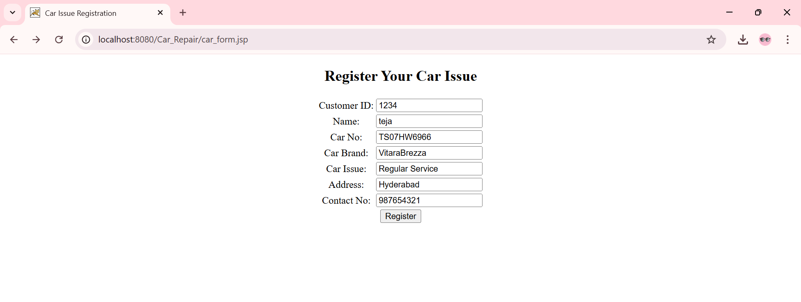
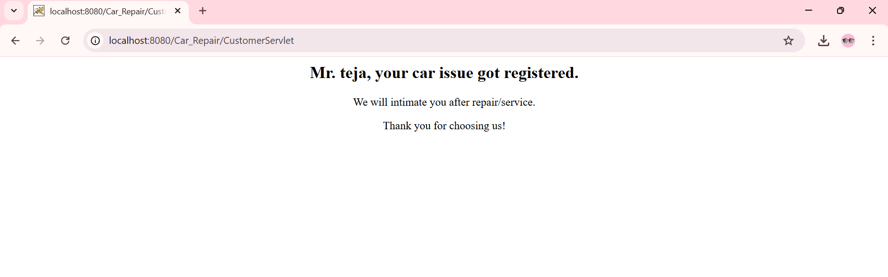
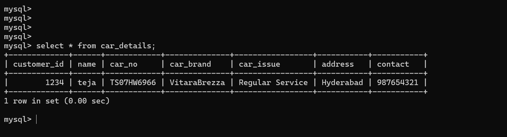
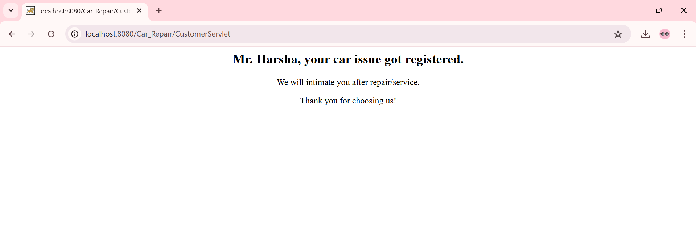
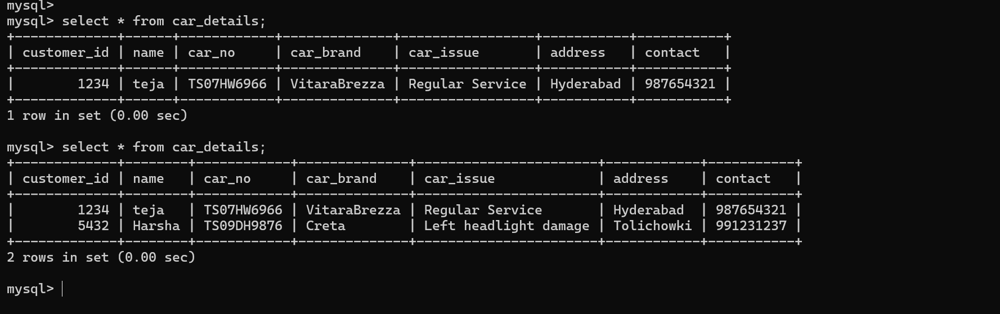

# Repair_Register
RepairRegister is a web application designed to streamline the car repair service registration process. Built using Java, JSP, Servlets, JDBC, and MySQL, this project allows customers to submit their vehicle issues through an online form, making garage operations more efficient and organized.

## ⚙️ How It Works

The **RepairRegister** application allows users to register their car issues for service or repair in a few simple steps:

### 1. User Accesses the Form
- The user opens the car service registration form (`Car_form.jsp`).
- They fill out details such as:
  - Name
  - Car Number
  - Car Brand
  - Car Issue Description
  - Address
  - Contact Number

### 2. Form Submission
- Upon clicking **Submit**, the form sends the data via a `POST` request to the server.
- The request is handled by the servlet (`CustomerServlet.java`).

### 3. Data Processing with Java Servlet & JDBC
- The servlet extracts form data and calls the DAO class (`CarDetailsDao.java`).
- JDBC is used to connect to the MySQL database (`vehicle`) and insert the data into the `car_details` table.

### 4. Confirmation Message
- If the data is successfully stored, the servlet forwards the user to `car_form.jsp`.
- A dynamic message is displayed:
  > **"Mr. <name>, your car issue got registered. We will intimate you after repair/service. Thank you for choosing us."**

### 5. Backend Storage
- The submitted records are securely stored in the MySQL database and can be accessed by the service center for follow-up, status updates, or reporting.

## User 1: Car Repair Form

Description:
-User 1 fills out the car repair registration form. Fields include Customer ID, customer name, car number, brand, issue description, address, and contact number.
This form sends a POST request to the servlet for database insertion.

## User 1: Submission Message

Description:
After submitting, a success message is shown:
"Mr. teja, your car issue got registered. We will intimate you after repair/service. Thank you for choosing us!"
This message is dynamically generated using servlet logic.

## User 1: MySQL Entry

Description:
The data submitted by User 1 is successfully stored in the car_details table of the vehicle MySQL database.

## User 2: Car Repair Form

Description:
Another user Harsha fills in the form with her vehicle and contact details. The same form is reused for multiple submissions by different users.

## User 2: Submission Message

## User 1 & 2: MySQL Entry

Description:
The MySQL table now reflects both submissions. It confirms that each user’s data is correctly inserted and the system supports multiple registrations.

## Features
Customer form to register car issues

Collects name, car number, brand, issue, address & contact

Stores data securely in MySQL database(vehicle.car_details)

Displays personalized success message after form submission

Built with standard Java EE technologies (JSP, Servlet, JDBC)

Ideal for garages, workshops, or service centers

## Tech Stack
Frontend: JSP, HTML, CSS

Backend: Java Servlets, JDBC

Database: MySQL (vehicle DB, car_details table)

Server: Apache Tomcat 10+

Tools: Eclipse, GitHub Desktop
